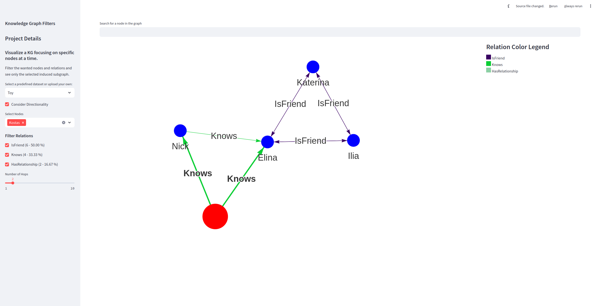

# seegraph
Dirty graph visualization on local files, focusing on a subset of a big graph.T

This is a work in-progress expect some bugs and limited functionality.


## Run
Install requirements with:

```cmd
pip install -r requirements.txt
```

and then simply run the app:

```cmd
streamlit run app_to_show.py
```

Go to [localhost](http://localhost:8501) (or the corresponding port provided in streamlit run) and see something like the following:

